# 1. What is a Database

* Postgre vs SQL

Postgre is an object-relational DB (ORDB) management system (also known as a DB engine) while SQL is a Structured Query Language. SQL allows to interact with ORDB such as Postgre.

* How data is stored

Data is stored in tables and tables are formed by rows and columns.

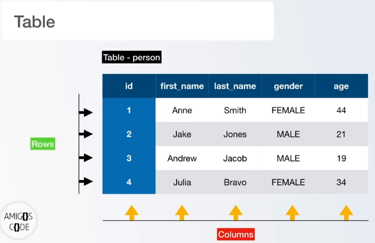

* What is a relational database

A relational DB is a relation between one or more tables

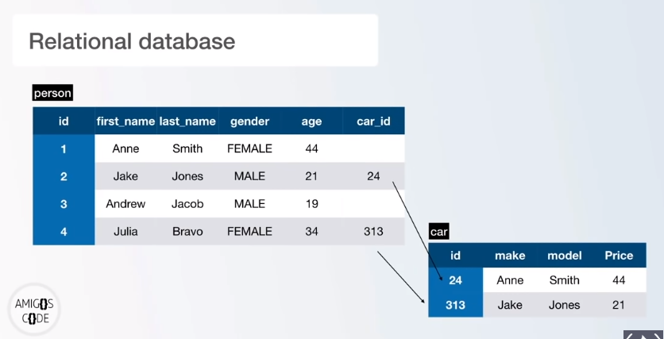

# 2. How to connect to DB server

Locally, our computer acts as a DB server. Below are different options to connect to the DB server (our computer):

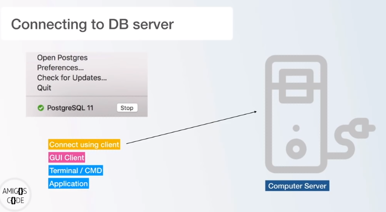

## 2.1. GUI Clients
Below are some clients that can be used to connect to our DB server:

* DataGrip
* Postico
* pg Admin 4 (for Windows users)

## 2.2. Terminal / Command Line (CLI)

In the Windows start-up menu, search for "SQL Shell (psql)".

### 2.2.1. Connection to a database using SQL Shell (psql)

* **Connection**
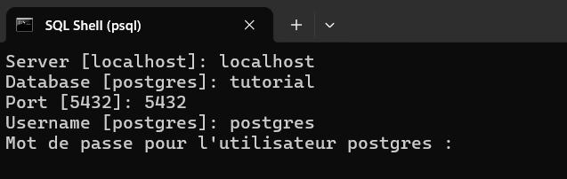


* **Result after connection**

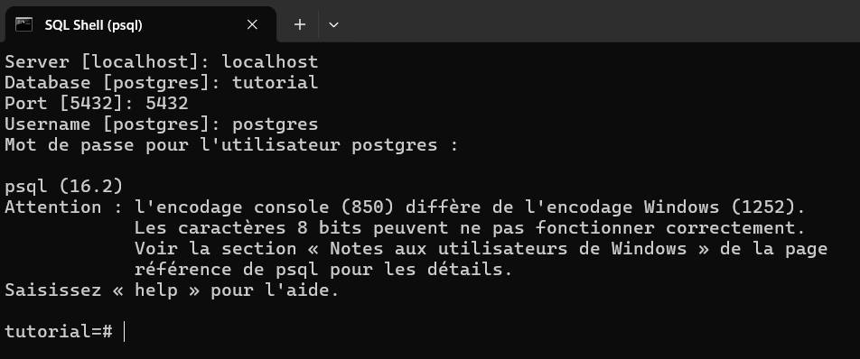

* **Create a new database named: test**

> * \? give you the help documentation. To quit: CTRL + C

> * \q followed by O to quit

> * \! cls to clear the terminal

> * \l list the currently available databases

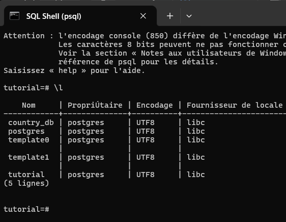

Database creation

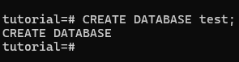

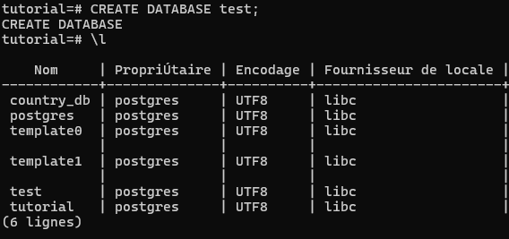

### 2.2.2. Connect to a database (here: test) using Windows CMD (or Powershell)

From now, we going to use Windows Command Promt (CMD) or Powershell. Note that the above CLI can be executed by CMD.

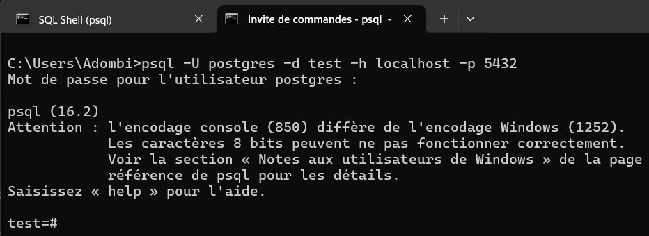

To switch to another database, you can type:
```
\c database_name
```

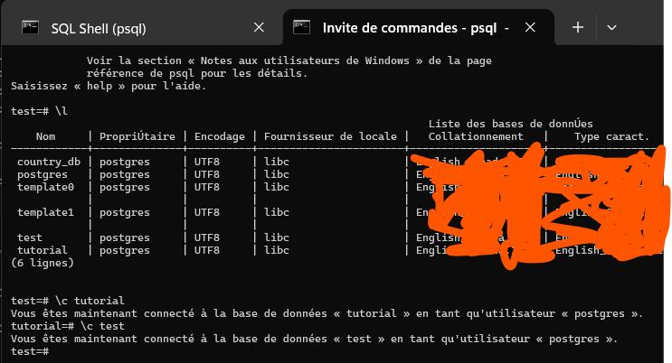

Note: In CMD, you can type `psql --help` to get some useful info.


### 2.2.3. A very dangerous command: DROP command

Before using it, be sure you have a backup of it


## 3. CRUD operations

### 3.1. CREATE A TABLE

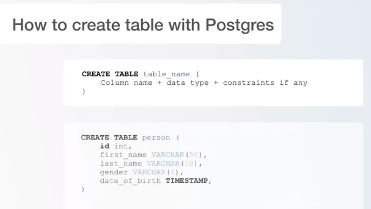

* **Complete list of data type in PostgreSQL**

https://www.postgresql.org/docs/current/datatype.html


* **Create a table without constraints**

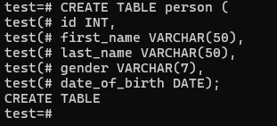

**And list tables using: \d, then describe table `person` using: `\d person`**

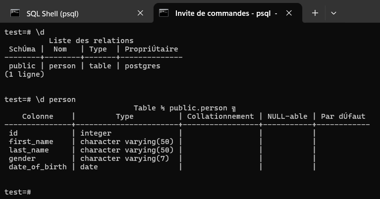


* **Create a table with constraints**

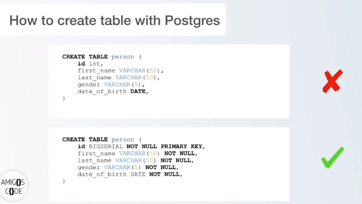


> First: drop our table

> Second: re-create it

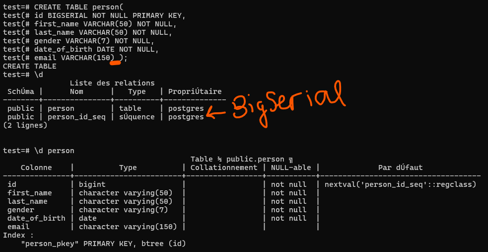

BIGSERIAL: AUTO_INCREMENT BIGINT

To see just the tables (and not the sequences for e.g.): `\dt`

### 3.2. INSERT RECORDS INTO A TABLE

#### 3.2.1. Manual insertion

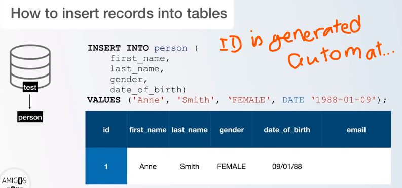


#### 3.2.2. Insert using data generated by Mockaroo (a webservice)

Mockaroo is a free test data generator and API mocking tool. Mockaroo lets you create custom CSV, JSON, SQL, Excel datasets etc to test and demo your software.

https://www.mockaroo.com/


This the configuration I made for our example (note: I added a new field: `country_of_birth`)

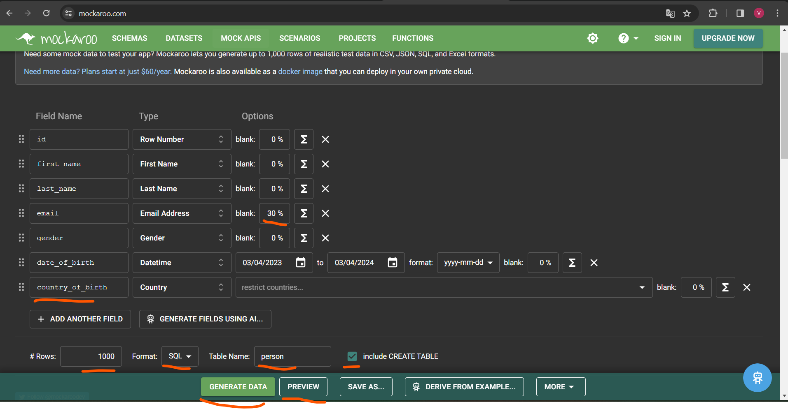


`\i path_to_file/person.sql` but as `country_of_birth` does not exist in our table person, we have to do this:

1. DROP TABLE person

2. Execute our file person.sql which contains at first an instruction to create a `person` table

`\i path_to_file/person.sql`

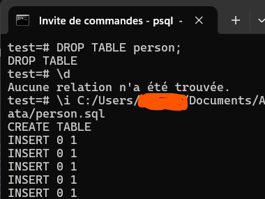

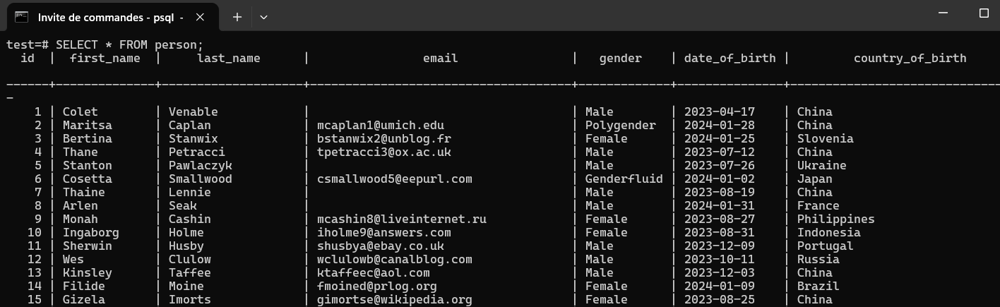

### 3.3. Read records from a table

#### 3.3.1. Select from and limit

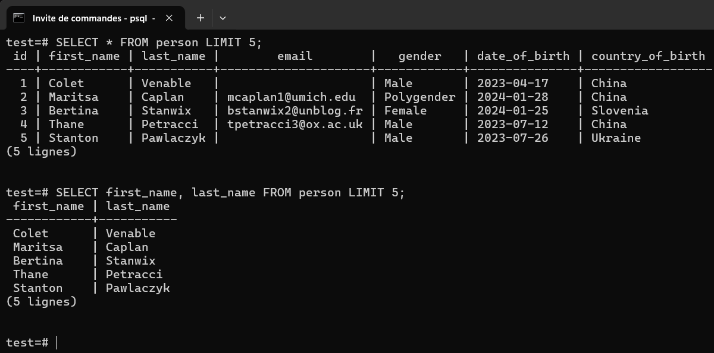


#### 3.3.2. Select from, limit and order by

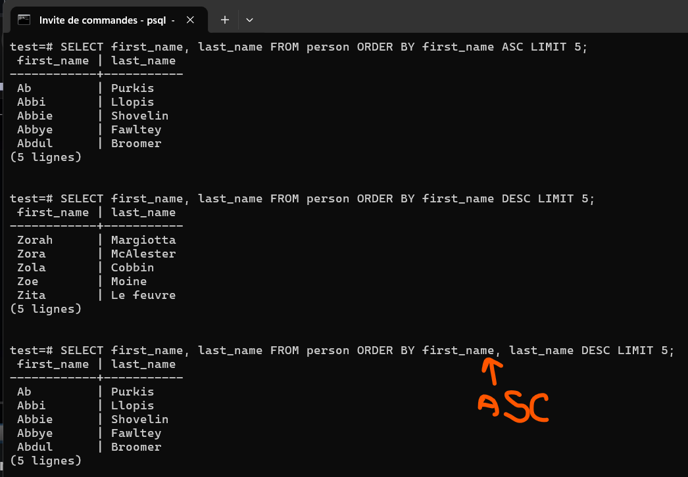

#### 3.3.3. Select from, limit, order by and distinct

Retrieve data without duplicates

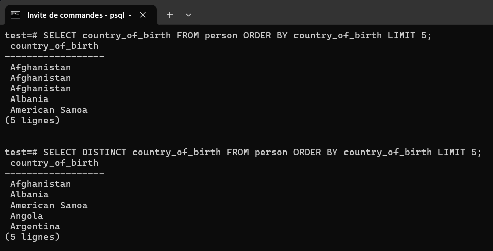

#### 3.3.4. Where clause and AND/OR

Another method to filter data

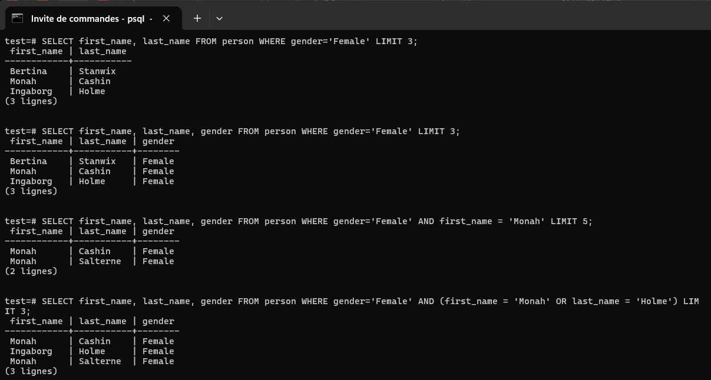

#### 3.3.5. Comparison operators

* **How they works**
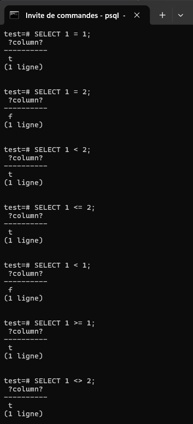

* **Practical example**

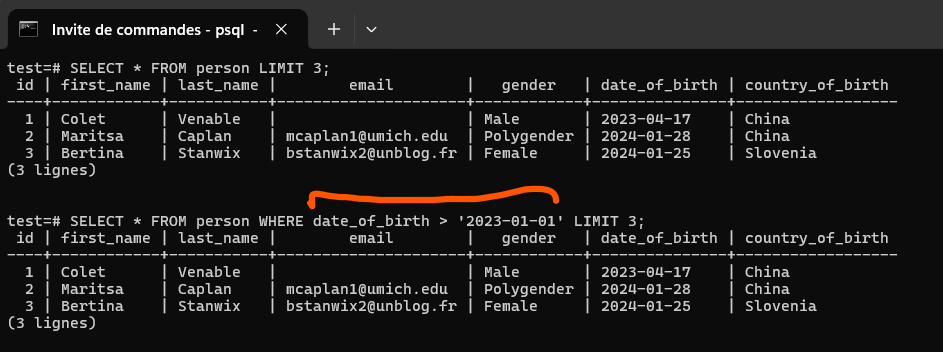

#### 3.3.6. Limit, Offset and fetch

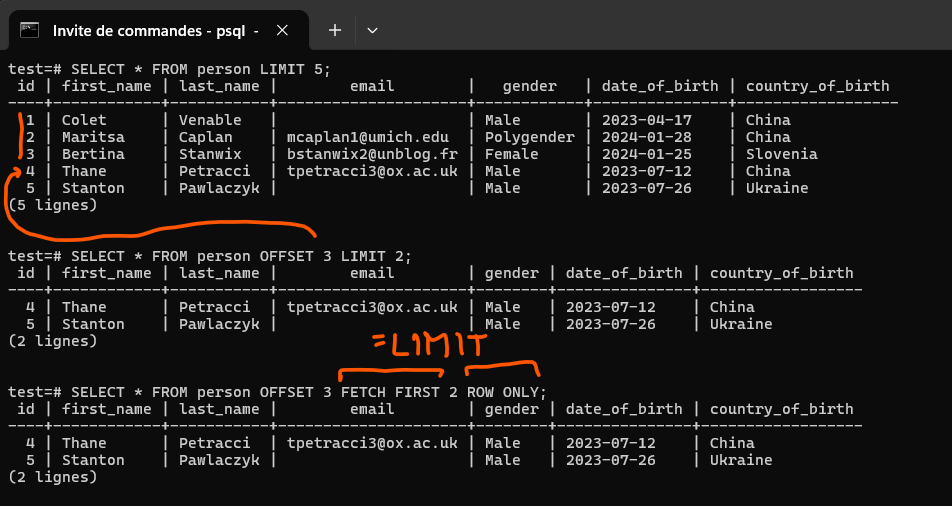


#### 3.3.7. IN

Allows to select data that mathces many values in a list

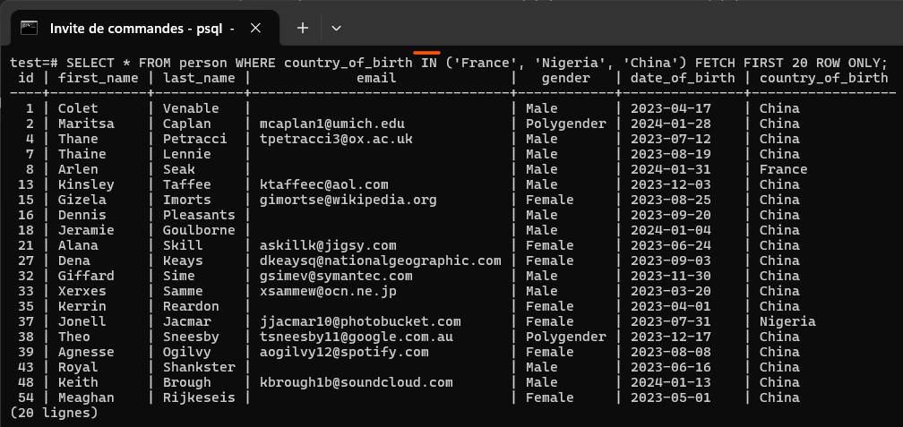

#### 3.3.8. BETWEEN

Select data between two numerical-like values such as date, integers, float, ...

So, it allows to select records with a certain column contained in a range [a, b].


#### 3.3.9. LIKE and ILIKE

LIKE is used to match a pattern

For example, let's get records with email ending by
1. `.com`
2. `@about.com`

`%` is a regular expression meaning any number of characters. So, `%.com` means any number of characters followed by `.com`.

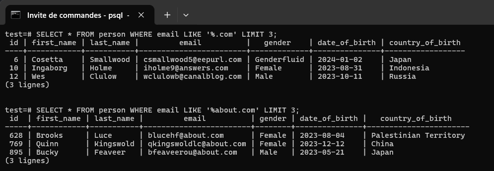

