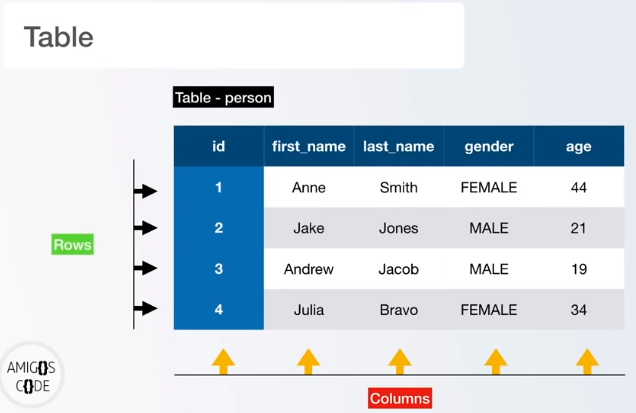
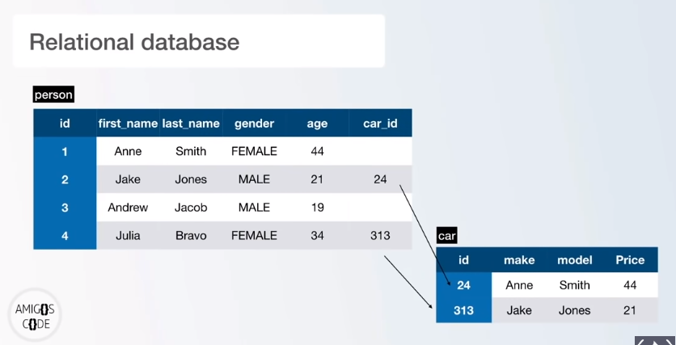
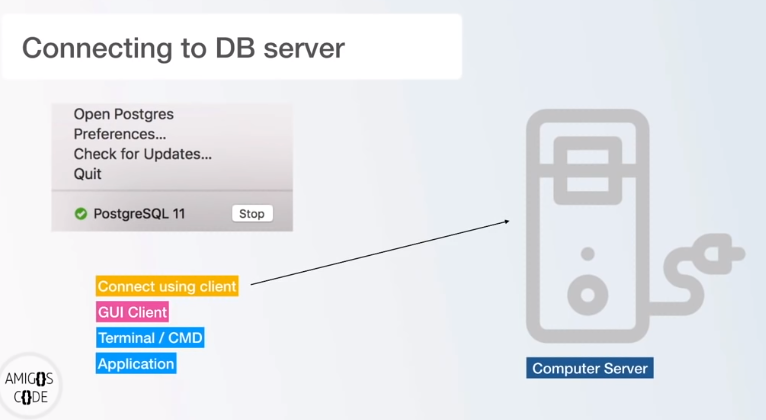

# What is a Database

* Postgre vs SQL

Postgre is an object-relational DB (ORDB) management system (also known as a DB engine) while SQL is a Structured Query Language. SQL allows to interact with ORDB such as Postgre.

* How data is stored

Data is stored in tables and tables are formed by rows and columns.

* What is a relational database

A relational DB is a relation between one or more tables

# How to connect to DB server

Locally, our computer act as a DB server. Below are different options to connect to the DB server (our computer):

