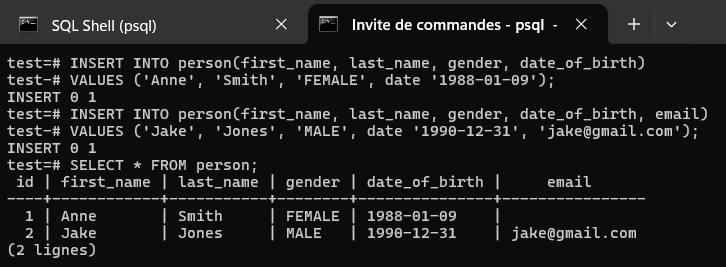
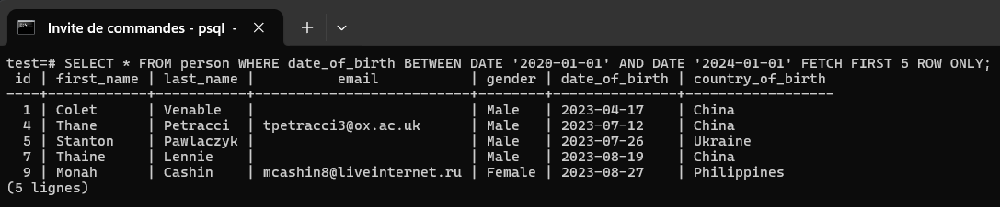
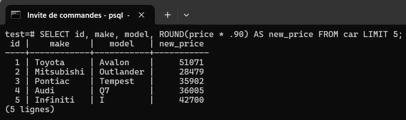
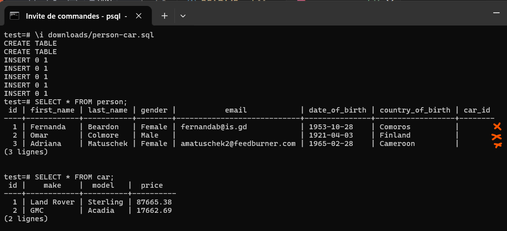
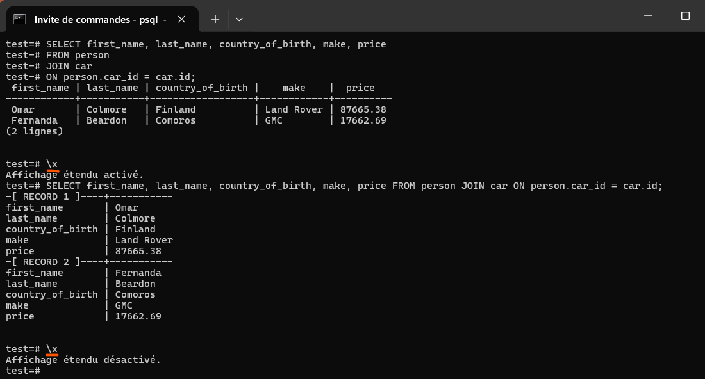

# 1. What is a Database

* Postgre vs SQL

Postgre is an object-relational DB (ORDB) management system (also known as a DB engine) while SQL is a Structured Query Language. SQL allows to interact with ORDB such as Postgre.

* How data is stored

Data is stored in tables and tables are formed by rows and columns.


* What is a relational database

A relational DB is a relation between one or more tables


# 2. How to connect to DB server

Locally, our computer acts as a DB server. Below are different options to connect to the DB server (our computer):


## 2.1. GUI Clients
Below are some clients that can be used to connect to our DB server:

* DataGrip
* Postico
* pg Admin 4 (for Windows users)

## 2.2. Terminal / Command Line (CLI)

In the Windows start-up menu, search for "SQL Shell (psql)".

### 2.2.1. Connection to a database using SQL Shell (psql)

* **Connection**


* **Result after connection**


* **Create a new database named: test**

> * \? give you the help documentation. To quit: CTRL + C

> * \q followed by O to quit

> * \! cls to clear the terminal

> * \l list the currently available databases


Database creation


### 2.2.2. Connect to a database (here: test) using Windows CMD (or Powershell)

From now, we going to use Windows Command Promt (CMD) or Powershell. Note that the above CLI can be executed by CMD.


To switch to another database, you can type:
```
\c database_name
```


Note: In CMD, you can type `psql --help` to get some useful info.


### 2.2.3. A very dangerous command: DROP command

Before using it, be sure you have a backup of it


## 3. CRUD operations

### 3.1. Create a table


* **Complete list of data type in PostgreSQL**

https://www.postgresql.org/docs/current/datatype.html


* **Create a table without constraints**


**And list tables using: \d, then describe table `person` using: `\d person`**


* **Create a table with constraints**


> First: drop our table

> Second: re-create it


BIGSERIAL: AUTO_INCREMENT BIGINT

To see just the tables (and not the sequences for e.g.): `\dt`

### 3.2. INSERT RECORDS INTO A TABLE

#### 3.2.1. Manual insertion




#### 3.2.2. Insert using data generated by Mockaroo (a webservice)

Mockaroo is a free test data generator and API mocking tool. Mockaroo lets you create custom CSV, JSON, SQL, Excel datasets etc to test and demo your software.

https://www.mockaroo.com/


This the configuration I made for our example (note: I added a new field: `country_of_birth`)


`\i path_to_file/person.sql` but as `country_of_birth` does not exist in our table person, we have to do this:

1. DROP TABLE person

2. Execute our file person.sql which contains at first an instruction to create a `person` table

`\i path_to_file/person.sql`


### 3.3. Read records from a table

#### 3.3.1. Select from and limit


#### 3.3.2. Select from, limit and order by


#### 3.3.3. Select from, limit, order by and distinct

Retrieve data without duplicates


#### 3.3.4. Where clause and AND/OR

Another method to filter data


#### 3.3.5. Comparison operators

* **How they works**


* **Practical example**


#### 3.3.6. Limit, Offset and fetch


#### 3.3.7. IN

Allows to select data that mathces many values in a list


#### 3.3.8. BETWEEN

Select data between two numerical-like values such as date, integers, float, ...

So, it allows to select records with a certain column contained in a range [a, b].




#### 3.3.9. LIKE and ILIKE

LIKE is used to match a pattern

For example, let's get records with email ending by
1. `.com`
2. `@about.com`

`%` is a regular expression meaning any number of characters. So, `%.com` means any number of characters followed by `.com`.


Another example:

1. `%@google.%`: any # chars before `@google.` and any # chars after
2. `________@%`: 8 `_` so any 8 chars before `@` followed by any chars after
3. country_of_birth = `Z%`: starting by Z (it is case-sensitive)
4. Use ILIKE to make it case-insensitive


#### 3.3.10. GROUP BY

It allows to group records based on one or more columns

1. How many peoples we have for each country in our table `person`

* **Step 1: Select all pepole in the table**
* **Step 2: Group people by country_of_birth -> group of countries, each containing they people**
* **Step 3: count the number of people for each group (i.e., each country)**
* **Step 4: return country_name and count and order by country_name**


#### 3.3.10. GROUP BY HAVING

`HAVING` allows to perform a filtering after a `GROUP BY`. It is analogous to `WHERE` but `WHERE` cannot be used after `GROUP BY`.

1. How many peoples we have for `France` and `Nigeria` in our table `person`

* **Step 1: Select all pepole in the table**
* **Step 2: Group people by country_of_birth -> group of countries, each containing they people**
* **Step 3: count the number of people for each group (i.e., each country)**
* **Step 4: get results for France and Nigeria only**
* **Step 5: return country_name and count and order by country_name in DESC**


2. Get `countries` with more than `50` people in our table `person`

* **Step 1: Select all pepole in the table**
* **Step 2: Group people by country_of_birth -> group of countries, each containing they people**
* **Step 3: count the number of people for each group (i.e., each country)**
* **Step 4: get countries with count > 70**
* **Step 5: return country_name and count**


Note: you can only use column aliases once the selection has been executed. It's the case after HAVING for example.

**Aggregate functions**

https://www.postgresql.org/docs/9.5/functions-aggregate.html


### 3.4. Add new table and data using Mockaroo


For `price` field, I added the following function to remove the `$` symbol.

```
this.gsub("$", "")

this.gsub("$", ""): replace '$' by ''
```

#### 3.4.1. Calculate Min, Max & Avg

1. Return the max, min, avg car's price in our table `car`


2. Return the min price for each couple (`make`, `model`)

* **Step 1: Select all cars**
* **Step 2: Group them by (make, model)**
* **Step 3: For each group, compute the min price**
* **Step 4: Return the make, model and price of the cars in step 3**
* **Step 5: Order by min price in ASC order**
* **Step 6: Limit to 10 cars**
* **Step 7: round prices to integers**


2. Return the max price for each `make`


#### 3.4.2. Calculate SUM

1. Total sum of prices for each car's make


#### 3.4.2. Basic arithmetic functions


1. Suppose we want to reduce the price of the car by 10%. Send back the new price.

`new_price = price - 0.1 * prince = price * 0.9`
 
Round the new price




#### 3.4.3. Coalesce

1. Select all `person` and for those without `email` return `email not provided` in the `email` column

Use `Coalesce` to specify that if `email` is null then replace it by the first value found in the `coalesce` list.

```
1. Case 1
COALESCE(email, 'Email not provided') => if email = null, it will be replaced by:
Email not provided

2. COALESCE(email, first_name, 'Email not provided') => if email = null, it will be replaced by first_name but if first_name is not found also, it will be replaced by:
Email not provided
```


#### 3.4.4. NULLIF

```
NULLIF(param1, param2) = {
    param1 if param1 <> param2,
    return nothing if param1 == param2
}
```

1. Handle division by zero


```
SELECT COALESCE(10 / NULLIF(diviser, 0), 0) => if diviser = 0, 10 / NULLIF(diviser, 0) will return null and COALESCE will return 0 else it will return 10 / diviser
```

#### 3.4.5. Timestamps and dates


**Date/Time types**

https://www.postgresql.org/docs/current/datatype-datetime.html


#### 3.4.5.1. Add and subtract with dates


#### 3.4.5.2. Extracting fields


#### 3.4.5.2. Age function

1. Return all column + a new column in `person` table which represents the age

```
AGE(NOW(), date_of_birth)
```

```
SELECT *, AGE(NOW(), date_of_birth) AS age FROM person;
```


2. Extract only the YEAR


### 3.5. Delete records from a table

```
DELETE FROM person WHERE id = 1000;
```

Delete all records (be carefull with this!)


```
DELETE FROM person;
```

### 3.6. Update records from a table


Update all records (be carefull with this!)

```
UPDATE person SET email = 'username@gmail.com';

This change the email of all records by 'username@gmail.com'
```

Update a record

```
UPDATE person SET email = 'username@gmail.com', last_name = 'Naruto' WHERE id = 1000;
```

### 3.7. On conflict, do nothing

Imagine we want to add a new record with id = 1 for example. As id is a PK, this will trigger an error. To avoid stopping the execution of the request, we can add `ON CONFLICT (id) DO NOTHING` at the end of our request.


`ON CONFLICT` work only for columns with constraints such as PK, UNIQUE, CHECK CONSTRAINTS, ...


### 3.8. Upsert: On conflict, do something

Sometimes, on conflict, we wants to do something such as UPDATE the corresponding records. To update, just specify the column name and use the `EXCLUDED.colum_name` to set a new value.


# 4. Relationships

## 4.1. Primary Key


To create a primary in an existing table:

```
ALTER TABLE person ADD PRIMARY KEY (id);

For this to work, make sure that before ALTER you deleted duplicate ids
```

## 4.2. Unique constraints

Constraints one column or a combinaison of columns to have unique values


## 4.3. Check constraints

Allows to add a constraint based on a boolean condition

In the example below, when inserting a record, if gender is not part of the listed genders below, an error will be triggered. But we can also alter the table to include more genders also.


## 4.4. Foreign keys, Joins and Relationships

### 4.4.1. Foreign keys and relationships


Let's build this relationship.

* **Step 1: Drop both tables**
* **Step 2: Recreate both tables with FK**

```
See person-car.sql
```



* **Step 3: Update FK in `person` table**


### 4.4.2. Joins

#### 4.4.2.1. Inner Join

Take all records where columnA = columnB and return a new table with all_columns_of_A, all_columns_of_B by default


1. Get all people with car

Return only:
    * first_name
    * last_name
    * country_of_birth
    * make
    * price

* **Step 1: Select all people**
* **Step 2: For each people with a car, retrieve its car info**
* **Step 3: return the desired columns**




